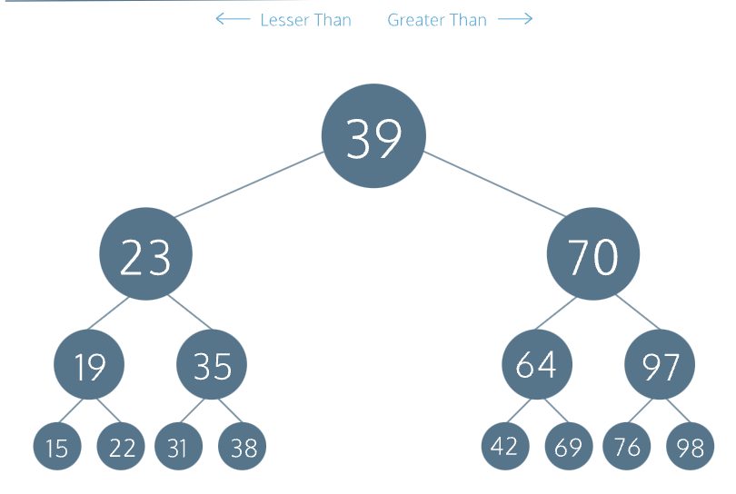

# Introdução

fonte: Codecademy
link: <https://www.cs.usfca.edu/~galles/visualization/Search.html>

Uma árvore binária é uma estrutura de dados eficiente para armazenamento e recuperação de dados rápidos devido ao seu tempo de O(log N)execução. É uma estrutura de dados de árvore especializada que é composta por um nó raiz e, no máximo, duas ramificações ou subárvores filhas. Cada nó filho é em si uma árvore binária.

Cada nó tem as seguintes propriedades:

* dados

* um valor de profundidade, onde a profundidade de 1 indica o nível superior da árvore e uma profundidade maior que 1 é um nível em algum lugar mais baixo na árvore

* um ponteiro esquerdo que aponta para um filho esquerdo que é em si uma árvore binária e deve ter um dado menor que os dados do nó raiz

* um ponteiro direito que aponta para um filho direito que é em si uma árvore binária e deve ter dados maiores que os dados do nó raiz

## Inserindo valores

Ao inserir um novo valor em uma árvore binária, comparamos com o valor do nó raiz:

If the new value is less than the root node's value
  If a left child node doesn't exist
    Create a new BinaryTree with the new value at a greater depth and assign it to the left pointer
  Else
    Recursively call .insert() on the left child node
Else
  If a right child node doesn't exist
    Create a new BinaryTree with the new value at a greater depth and assign it to a right pointer
  Else
    Recursively call .insert() on the right child node

Vamos ilustrar o procedimento de inserção com uma árvore cujo nó raiz possui os dados 100.

Insert 50
50 < 100, left child node doesn't exist, create a left child node
       100
       /
     50
Insert 125
125 > 100, right child node doesn't exist, create a right child node
        100
       /   \
      50    125
Insert 75
75 < 100, left child node of 50 exists, recursive insert at left child
75 > 50, right child node doesn't exist, create a right child node
        100
       /   \
      50    125
       \
       75
Insert 25
25 < 100, left child node of 50 exists, recursive insert at left child
25 < 50, left child node doesn't exist, create a left child node
        100
       /   \
      50    125
     /  \
    25  75

## Recuperar um nó por valor

Lembre-se de que uma árvore de pesquisa binária fornece uma maneira rápida e eficiente de armazenar e recuperar valores. Assim como com .insert(), o procedimento para recuperar um nó de árvore por seu valor é recursivo. Queremos percorrer o ramo correto da árvore comparando o valor alvo com o valor do nó atual.

O caso base para nosso método recursivo é que quando os valores coincidem, retornamos o nó atual. A etapa recursiva é chamar a si mesmo de um nó filho esquerdo ou direito existente com o valor.

If target value is the same as the current node value
  Return the current node
Else
  If target value is less than the root node's value and there is a left child node
    Recursively search from the left child node
  Else if there is a right child node
    Recursively search from the right child node

Dada a seguinte árvore:

        100
       /   \
      50    125
     /  \
    25  75
Para recuperar 75, o algoritmo procederia da seguinte forma:

At root node, 75 < 100 and there is a left child

        100
       /   \
 ==>  50    125
     /  \
    25  75

At the node 50, 75 > 50 and there is a right child

        100
       /   \
      50    125
     /  \
    25  75 <==

Node 75 = 75, return this node

## Atravessando uma árvore binária

Existem duas maneiras principais de percorrer uma árvore binária: primeiro em largura e primeiro em profundidade. Com a travessia em largura, começamos a travessia no topo do nó raiz da árvore, exibindo seus dados e continuando o processo com o nó filho esquerdo e o nó filho direito. Desça um nível e repita esta etapa até terminarmos de exibir todos os nós filhos no nível mais profundo da esquerda para a direita.

Com a travessia em profundidade, sempre percorremos totalmente cada galho do lado esquerdo de uma árvore antes de prosseguir pelo galho direito. No entanto, existem três opções de travessia:

* **Pré -encomenda** é quando executamos uma ação no nó atual primeiro, seguido por seu nó filho esquerdo e seu nó filho direito

* **Inorder** é quando executamos uma ação primeiro no nó filho esquerdo, seguido pelo nó atual e pelo nó filho direito

* **Pós -ordem** é quando executamos uma ação primeiro no nó filho esquerdo, seguido pelo nó filho direito e depois no nó atual

Para esta lição, implementaremos a opção inorder. A vantagem desta opção é que os dados são exibidos em ordem ordenada do menor para o maior.

Para ilustrar, digamos que temos uma árvore binária que se parece com isso:

           15
     /------+-----\
    12            20
   /   \         /   \
 10     13     18     22
 / \   /  \    / \   /  \
8  11 12  14  16 19 21  25

Começamos percorrendo a subárvore esquerda em cada nível, o que nos leva a 8, 10e 11reside. O percurso inorder seria:

8, 10, 11
Subimos um nível para visitar o nó raiz 12antes de descermos de volta ao fundo, onde reside a subárvore direita de 12, 13e . 14A travessia em ordem continua com:

12, 12, 13, 14
Subimos novamente um nível para visitar o nó raiz 15antes de percorrermos a subárvore direita começando no nível inferior novamente. Continuamos com a subárvore inferior esquerda onde 16, 18e 19residem. A travessia inorder continua com:

15, 16, 18, 19
Subimos um nível para visitar o nó raiz 20antes de descermos de volta ao fundo, onde reside a subárvore mais à direita de 21, 22e .25

A travessia termina com:

20, 21, 22, 25
Todo o percurso torna-se:

8, 10, 11, 12, 12, 13, 14, 15, 16, 18, 19, 20, 21, 22, 25
Observe que todos os valores exibidos são classificados em ordem crescente.
