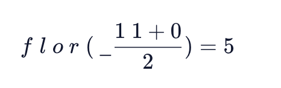

# Busca binária

fonte: Codecademy;

## Encontrando o índice médio

Uma etapa chave em cada iteração de pesquisa binária é encontrar o valor do meio do contexto da lista atual. Na prática, fazemos isso rastreando o primeiro e o último índices e, em seguida, encontrando sua média.

O primeiro índice que verificamos sempre será o valor do meio da lista original. Por causa disso, começamos definindo os seguintes primeiros ( left) e últimos ( right) índices. Abaixo, mostramos um exemplo de pseudocódigo de como definir essas variáveis.

function binarySearch (arr, target)
  left = 0
  right = length of arr
  . . .

Poderíamos chamar uma implementação:
const searchable = [1, 2, 7, 8, 22, 28, 41, 58, 67, 71, 94];
const target = 41;

Como passamos um array de tamanho 11, a rightvariável é definida como 11.

Em seguida, calculamos o índice do meio do array:

function binarySearch (arr, target)
  left = 0
  right = length of arr

  indexToCheck = the floor integer of (left + right) / 2
  . . .

A função acima calculará o índice do meio da matriz calculando a média de rightand lefte arredondando-o para o número inteiro do piso. Dado lefté zero e righté 11:

 

 Portanto, o primeiro índice que a função verifica é 5.

## Verificando o index médio

Vamos considerar como implementar uma abordagem para verificar se o valor em indexToChecké igual ao valor de destino. Abaixo, usamos pseudocódigo para exibir duas etapas adicionais que verificarão se o targetvalor foi encontrado

function binarySearch (arr, target)
  left = 0
  right = length of arr

  indexToCheck = the floor integer of (left + right) / 2

  checking = value of arr at indexToCheck

  if checking is the target
    return indexToCheck

## Verificação interativa
Neste ponto, você tem uma função que verifica o índice do meio de uma matriz de entrada e retorna o índice se o valor for igual a target. Vamos considerar como estender a função para verificar sublistas iterativamente quando o valor do meio não for igual a target.

Lembre-se de nosso algoritmo, a função continua a ser executada até que os índices esquerdo e direito convirjam ou o alvo seja encontrado. Na prática, podemos implementar isso com a seguinte while condição.

while right is greater than left
 indexToCheck = the floor integer of (left + right) / 2
 checking = value of arr at indexToCheck

 if checking is the target
   then return indexToCheck

Infelizmente, o código acima será executado infinitamente porque nossas variáveis right​​e leftnão convergem de uma iteração para a próxima. Para resolver esse problema, além de verificar se o valor atual é o valor de destino, precisamos ajustar o índice rightou a cada iteração.left

while right is greater than left
  indexToCheck = the floor integer of (left + right) / 2
  checking = value of arr at indexToCheck

  if checking is the target
    then return indexToCheck
  if target is greater than checking
    then set left to indexToCheck + 1
  else
    set right to indexToCheck

No código acima, definimos o índice leftor para um novo valor com base em ser maior ou menor que . O loop acima continuará a ser executado até que o índice seja maior que o índice.righttargetcheckingwhileleftright

Nos pontos de verificação abaixo, você adicionará condições que alteram o índice leftou com base em ser maior ou menor que . A cada iteração, a distância de até será reduzida pela metade.rightcheckingtargetleftright
