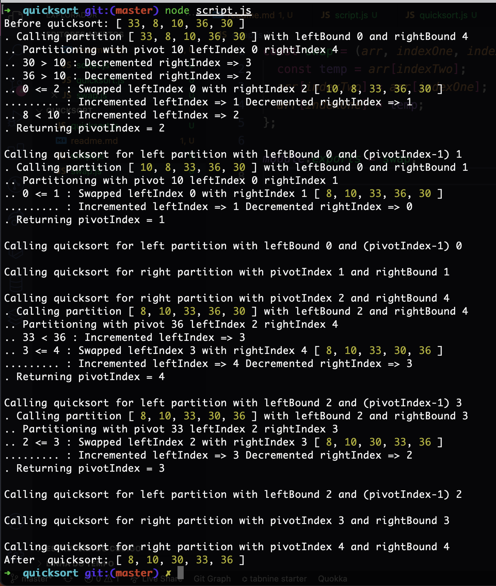

# Cheatseet

* todos os elementos na partição esquerda devem ser menores ou iguais ao elemento pivô

* todos os elementos na partição direita devem ser maiores ou iguais ao elemento pivô

O pseudocódigo para nosso algoritmo quicksort é o seguinte:

_________
If there is more than one element left in the array:
  Find the pivot index through partitioning

  If the left pointer is less than the pivot index:
    Call quicksort() on the portion of the array between the left pointer and the pivot.

  If the pivot index is less than the right pointer:
    Call quicksort() on the portion of the array between the pivot index and the right pointer.

Return the sorted array

## Classificação rápida recursivas

As etapas recursivas são executadas após o particionamento:

* Chamada quicksort()para processar apenas a partição esquerda limitada pelo ponteiro esquerdo e (índice pivô - 1) para excluir o elemento pivô da partição esquerda

* Chamada quicksort()para processar apenas a partição direita limitada pelo índice pivô e ponteiro direito

### Console.log

