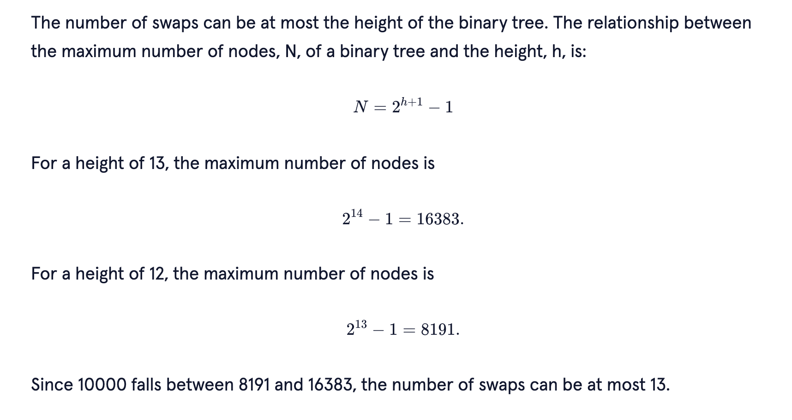

font: Codecademy

# Introduction

A heap data structure is a specialized tree data structure that satisfies the heap condition:

In a max-heap, for any given element, its parent’s value is greater than or equal to its value.
In a min-heap, for any given element, its parent’s value is less than or equal to its value.
A heap data structure is commonly implemented as a binary tree. In this lesson, we’re going to implement a min-heap in JavaScript. Min-heaps efficiently keep track of the minimum value in a dataset, even as we add and remove elements.

Heaps enable solutions for complex problems such as finding the shortest path (Dijkstra’s Algorithm) or efficiently sorting a dataset (heapsort).

They’re an essential tool for confidently navigating some of the difficult questions posed in a technical interview.

By understanding the operations of a heap, you will have made a valuable addition to your problem-solving toolkit.

Instructions
1.
The code in script.js creates a min-heap one element at a time from a random collection of numbers. It then removes the minimum value from the min-heap one at a time as well.

Run the code a few times to see the effects of adding and removing items in the min-heap printed to the screen.

Move to the next exercise when you’re ready to dig in further!

